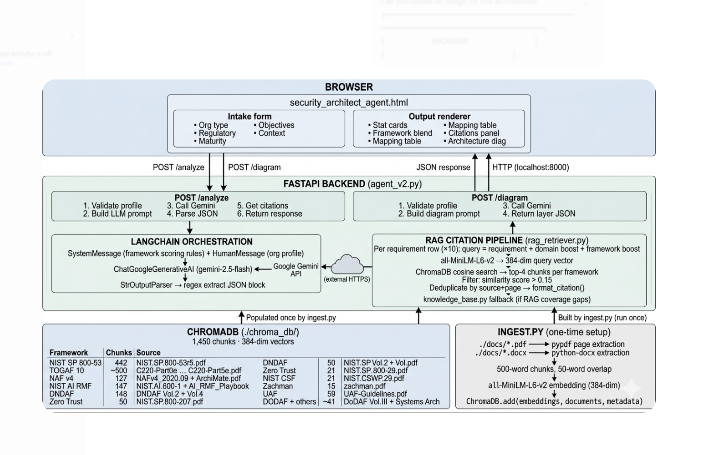

# Security Architecture Framework Agent

> An AI-powered security architecture tool that takes an organisation's strategic objectives and generates a tailored framework mapping, conceptual architecture diagram, and cited framework clauses — grounded in 1,450 chunks from 22 real security framework documents.

[](https://python.org)
[](https://aistudio.google.com)
[](https://langchain.com)
[](https://trychroma.com)
[](https://fastapi.tiangolo.com)
[](LICENSE)

---

## What it does

Security architects today spend weeks manually cross-referencing SABSA, TOGAF, Zachman, NIST CSF, Zero Trust, NAF, and DODAF to produce a tailored security architecture. This agent does it in seconds.

**Given an organisation profile**, the agent:

1. Determines which frameworks apply at **macro level** (which frameworks and why) and **micro level** (which specific viewpoints, phases, and artifacts within each framework)
2. Generates a **10-requirement framework mapping table** with fit levels (primary / secondary / optional) per framework
3. Retrieves **real citations** from actual PDF documents with page numbers
4. Produces a **layered conceptual security architecture diagram** tailored to the objectives

---

## Live demo outputs

### Framework mapping — Financial services, PCI-DSS, cloud migration

| # | Requirement | Domain | SABSA | TOGAF | NIST CSF | Zero Trust |
|---|---|---|---|---|---|---|
| 01 | Define Business Security Outcomes | Governance | Business Viewpoint | Architecture Vision | Govern.Strategy | Policy Engine |
| 02 | Implement Centralised IAM | Identity | Service Management View | Phase C IS Architecture | PR.AA | Identity Pillar |
| 03 | Secure Network Segmentation | Network | Designer Viewpoint | Phase D Technology | Protect.Network | Network Pillar |
| ... | | | | | | |

### RAG citations — pulled from actual PDFs

```
TOGAF-p87: "All activities that have been initiated in these steps must be closed
during the Complete the Architecture Development Cycle and Document Lessons Learned
step; see Section 10.3.7..."

NIST AI RMF-p14: "of the C-Suite in organizations that maintain an AI portfolio,
should maintain awareness of AI risks, affirm the organizational appetite for such
risks, and be responsible for managing those risks..."

Zero Trust-p32: "ZERO TRUST ARCHITECTURE — the encrypted traffic and use that to
detect an active attacker or possible malware communicating on the network..."
```

---

## Architecture



> *Full data flow: browser intake form → FastAPI backend → LangChain + Gemini API → RAG citation pipeline → ChromaDB vector store → frontend output renderer.*

<details>
<summary>View as text diagram</summary>


```
┌─────────────────────────────────────────────────────────────────┐
│                        BROWSER                                  │
│                                                                 │
│  ┌─────────────────────────────────────────────────────────┐   │
│  │          security_architect_agent.html                  │   │
│  │                                                         │   │
│  │  ┌──────────────┐          ┌──────────────────────┐    │   │
│  │  │  Intake form  │          │   Output renderer    │    │   │
│  │  │               │          │                      │    │   │
│  │  │ • Org type    │          │ • Stat cards         │    │   │
│  │  │ • Regulatory  │          │ • Framework blend    │    │   │
│  │  │ • Maturity    │          │ • Mapping table      │    │   │
│  │  │ • Objectives  │          │ • Citations panel    │    │   │
│  │  │ • Context     │          │ • Architecture diag  │    │   │
│  │  └──────┬───────┘          └──────────▲───────────┘    │   │
│  │         │  POST /analyze               │ JSON response  │   │
│  │         │  POST /diagram               │                │   │
│  └─────────┼──────────────────────────────┼────────────────┘   │
└────────────┼──────────────────────────────┼────────────────────┘
             │  HTTP  (localhost:8000)       │
             ▼                              │
┌─────────────────────────────────────────────────────────────────┐
│                  FASTAPI BACKEND  (agent_v2.py)                 │
│                                                                 │
│  ┌──────────────────────┐   ┌──────────────────────────────┐   │
│  │   POST /analyze      │   │   POST /diagram              │   │
│  │                      │   │                              │   │
│  │ 1. Validate profile  │   │ 1. Validate profile          │   │
│  │ 2. Build LLM prompt  │   │ 2. Build diagram prompt      │   │
│  │ 3. Call Gemini       │   │ 3. Call Gemini               │   │
│  │ 4. Parse JSON        │   │ 4. Return layer JSON         │   │
│  │ 5. Get citations     │   └──────────────────────────────┘   │
│  │ 6. Return response   │                                      │
│  └──────────┬───────────┘                                      │
│             │                                                   │
│             ▼                                                   │
│  ┌─────────────────────────────────────────────────────────┐   │
│  │              LANGCHAIN ORCHESTRATION                    │   │
│  │                                                         │   │
│  │   SystemMessage (framework scoring rules)               │   │
│  │   + HumanMessage (org profile)                          │   │
│  │             │                                           │   │
│  │             ▼                                           │   │
│  │   ChatGoogleGenerativeAI (gemini-2.5-flash)             │   │
│  │             │                       ▲                   │   │
│  │             └──── Google Gemini API ┘  (external HTTPS) │   │
│  │             │                                           │   │
│  │             ▼                                           │   │
│  │   StrOutputParser → regex extract JSON block            │   │
│  └─────────────────────────────────────────────────────────┘   │
│             │                                                   │
│             ▼                                                   │
│  ┌─────────────────────────────────────────────────────────┐   │
│  │              RAG CITATION PIPELINE (rag_retriever.py)   │   │
│  │                                                         │   │
│  │   Per requirement row (×10):                            │   │
│  │   query = requirement + domain boost + framework boost  │   │
│  │             │                                           │   │
│  │             ▼                                           │   │
│  │   all-MiniLM-L6-v2  →  384-dim query vector            │   │
│  │             │                                           │   │
│  │             ▼                                           │   │
│  │   ChromaDB cosine search → top-4 chunks per framework   │   │
│  │   Filter: similarity score > 0.15                       │   │
│  │             │                                           │   │
│  │             ▼                                           │   │
│  │   Deduplicate by source+page → format_citation()        │   │
│  │             │                                           │   │
│  │             ▼                                           │   │
│  │   knowledge_base.py fallback (if RAG coverage gaps)     │   │
│  └─────────────────────────────────────────────────────────┘   │
└─────────────────────────────────────────────────────────────────┘
             ▲
             │  Populated once by ingest.py
             │
┌─────────────────────────────────────────────────────────────────┐
│                  CHROMADB  (./chroma_db/)                       │
│                  1,450 chunks · 384-dim vectors                 │
│                                                                 │
│  Framework          Chunks   Source                             │
│  ─────────────────────────────────────────────────────────      │
│  NIST SP 800-53       442    NIST.SP.800-53r5.pdf              │
│  TOGAF 10            ~500    C220-Part0e … C220-Part5e.pdf     │
│  NAF v4               127    NAFv4_2020.09 + ArchiMate.pdf     │
│  NIST AI RMF          147    NIST.AI.600-1 + AI_RMF_Playbook   │
│  DNDAF                148    DNDAF Vol.2 + Vol.4               │
│  Zero Trust            50    NIST.SP.800-207.pdf               │
│  NIST CSF              21    NIST.CSWP.29.pdf                  │
│  Zachman               15    zachman.pdf                       │
│  UAF                   59    UAF-Guidelines.pdf                │
│  DODAF + others       ~41    DoDAF Vol.III + Systems Arch      │
└─────────────────────────────────────────────────────────────────┘
             ▲
             │  Built by ingest.py (run once)
             │
┌─────────────────────────────────────────────────────────────────┐
│                   INGEST.PY  (one-time setup)                   │
│                                                                 │
│  ./docs/*.pdf  ──► pypdf page extraction                        │
│  ./docs/*.docx ──► python-docx extraction                       │
│                          │                                      │
│                          ▼                                      │
│               500-word chunks, 50-word overlap                  │
│                          │                                      │
│                          ▼                                      │
│               all-MiniLM-L6-v2 embedding (384-dim)             │
│                          │                                      │
│                          ▼                                      │
│               ChromaDB.add(embeddings, documents, metadata)     │
└─────────────────────────────────────────────────────────────────┘
```

</details>

---

## Frameworks covered

| Framework | Source | Chunks |
|---|---|---|
| NIST SP 800-207 (Zero Trust) | NIST (free) | 50 |
| NIST CSF 2.0 | NIST (free) | 21 |
| NIST SP 800-53 Rev 5 | NIST (free) | 442 |
| NIST AI RMF (600-1 + Playbook) | NIST (free) | 147 |
| TOGAF 10 (C220 Parts 0–5) | Open Group (free registration) | ~500 |
| NAF v4 + ArchiMate | NATO/OMG | 127 |
| DNDAF Vol. 2 & 4 | Defence | 148 |
| DODAF Vol. III | DoD | ~30 |
| Zachman Framework | Zachman.com | 15 |
| UAF Guidelines | NATO | 59 |
| Systems Architecture | Reference | 7 |

---

## Tech stack

| Component | Technology |
|---|---|
| LLM | Google Gemini 2.5 Flash via LangChain |
| Backend | FastAPI + Python 3.13 |
| Vector store | ChromaDB (local persistent) |
| Embeddings | sentence-transformers all-MiniLM-L6-v2 |
| PDF parsing | pypdf |
| Frontend | Vanilla HTML/CSS/JS (single file) |
| API framework | LangChain Google GenAI |

---

## Project structure

```
Security Architecture Agent/
├── agent_v2.py              # FastAPI backend + LangChain chains
├── ingest.py                # PDF ingestion → ChromaDB
├── rag_retriever.py         # Vector similarity retrieval
├── knowledge_base.py        # Fallback citation store
├── security_architect_agent.html  # Frontend UI
├── requirements.txt         # Python dependencies
├── .env                     # GOOGLE_API_KEY (not committed)
├── docs/                    # Framework PDFs
│   ├── NIST.SP.800-207.pdf
│   ├── NIST.CSWP.29.pdf
│   ├── NIST.SP.800-53r5.pdf
│   ├── NIST.AI.600-1.pdf
│   ├── AI_RMF_Playbook.pdf
│   ├── NAFv4_2020.09.pdf
│   ├── C220-Part0e.pdf      # TOGAF 10
│   ├── C220-Part1e.pdf
│   ├── ...
│   └── zachman.pdf
└── chroma_db/               # Auto-generated vector store
```

---

## Setup

### 1. Prerequisites

- Python 3.10+
- Google Gemini API key ([get one free](https://aistudio.google.com/apikey))

### 2. Install dependencies

```bash
pip install langchain langchain-google-genai fastapi uvicorn python-dotenv pydantic
pip install chromadb pypdf sentence-transformers python-docx
```

### 3. Configure API key

```bash
# Windows PowerShell
$env:GOOGLE_API_KEY = "your_key_here"

# Or create a .env file
echo "GOOGLE_API_KEY=your_key_here" > .env
```

### 4. Add framework PDFs

Download PDFs into a `docs/` folder. Free sources:
- NIST SP 800-207: https://nvlpubs.nist.gov/nistpubs/SpecialPublications/NIST.SP.800-207.pdf
- NIST CSF 2.0: https://nvlpubs.nist.gov/nistpubs/CSWP/NIST.CSWP.29.pdf
- TOGAF 10: https://www.opengroup.org/togaf (free registration)

### 5. Ingest PDFs into ChromaDB

```bash
python ingest.py
# Expected output: Ingestion complete! Total chunks stored: ~1450
```

### 6. Start the agent

```bash
python agent_v2.py
# Expected: [RAG] Ready — 1450 chunks loaded from ChromaDB
#           Uvicorn running on http://0.0.0.0:8000
```

### 7. Open the frontend

Open `security_architect_agent.html` in Chrome or Edge.

---

## Sample test profiles

### Financial services cloud migration

- **Org type:** Financial services
- **Regulatory:** PCI-DSS
- **Maturity:** Managed
- **Objectives:** Cloud-first migration + Infra modernization
- **Context:** Migrating 40 legacy Java banking apps to AWS. Must maintain PCI-DSS compliance throughout migration. New CISO hired 3 months ago. Target: zero trust posture for all cloud workloads by year end.

### Government Zero Trust

- **Org type:** Government / Public sector
- **Regulatory:** FedRAMP
- **Maturity:** Defined
- **Objectives:** Zero Trust + Infra modernization
- **Context:** Federal agency with 3,500 users across 6 locations. Mix of classified and unclassified workloads. DoD adjacent — must align to DODAF and NAF viewpoints for interoperability with allied systems.

### AI-native SaaS startup

- **Org type:** Technology / SaaS
- **Regulatory:** SOC 2 / ISO 27001
- **Maturity:** Initial
- **Objectives:** AI-native + API-first + DevSecOps
- **Context:** Series B startup building an AI-native analytics platform on GCP. 150 engineers. LLM-powered features handling customer financial data. Need security architecture covering AI model risk, API security, and SOC 2 Type II by Q3.

---

## API endpoints

| Endpoint | Method | Description |
|---|---|---|
| `/health` | GET | Agent status + RAG availability |
| `/analyze` | POST | Generate framework mapping |
| `/diagram` | POST | Generate conceptual architecture |

### Example request

```bash
curl -X POST http://localhost:8000/analyze \
  -H "Content-Type: application/json" \
  -d '{
    "org_type": "Financial services",
    "regulatory": "PCI-DSS",
    "maturity": "managed",
    "objectives": ["Cloud-first migration", "Infra modernization"],
    "context": "Migrating to AWS, 40 legacy apps"
  }'
```

---

## Roadmap

- [ ] Export mapping to Word/PowerPoint
- [ ] SABSA Blue Book integration (licensed PDF)
- [ ] Multi-turn conversational refinement
- [ ] Phased security roadmap output
- [ ] Comparison mode (run two profiles side by side)
- [ ] REST API for enterprise integration

---

## Built with

- [LangChain](https://langchain.com) — LLM orchestration
- [Google Gemini](https://aistudio.google.com) — AI backbone
- [ChromaDB](https://trychroma.com) — local vector database
- [FastAPI](https://fastapi.tiangolo.com) — backend API
- [sentence-transformers](https://sbert.net) — text embeddings

---

## Disclaimer

This tool is a prototype for research and architectural planning purposes. Framework citations are retrieved from publicly available documents. SABSA, TOGAF, Zachman, NAF, DODAF, and NIST are trademarks of their respective owners. This tool does not replace professional security architecture consulting.
